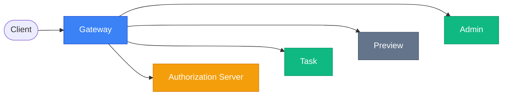
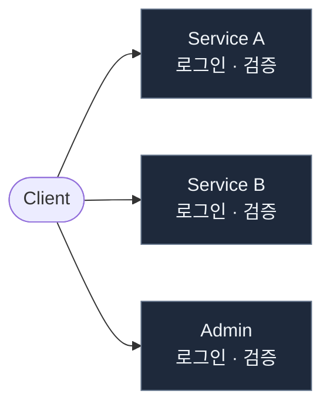
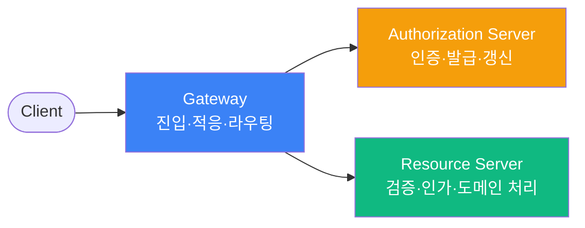
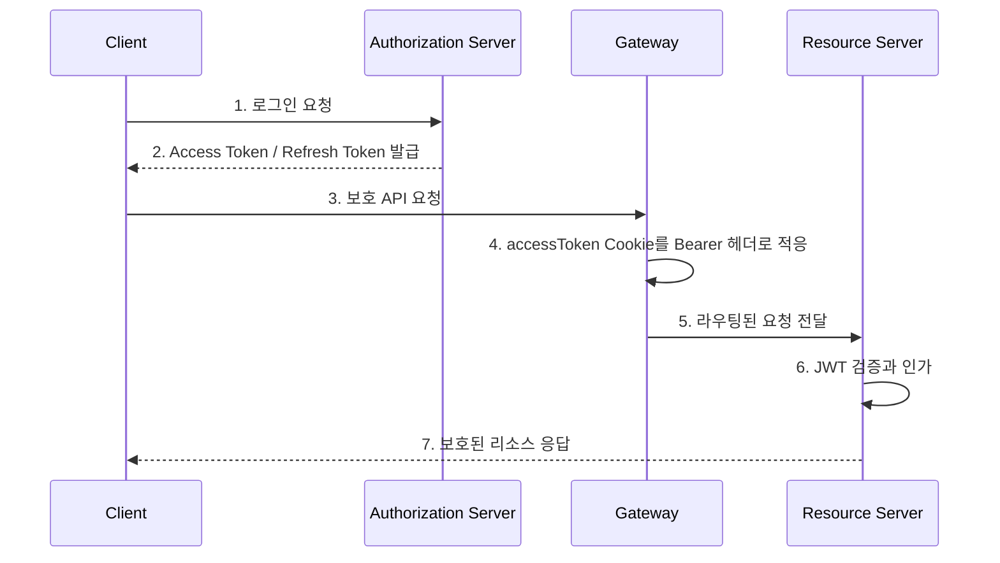
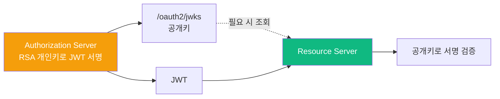
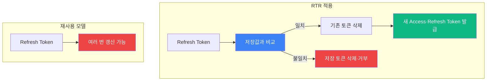
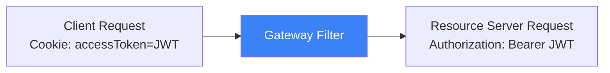
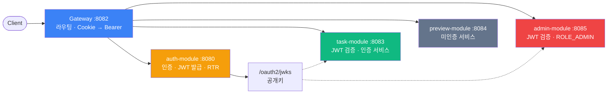

<div align="center">

# Auth Gateway Platform

**여러 서비스의 인증·인가를 어떻게 일관되게 관리할 것인가?**

</div>

## 00. Overview

Spring Cloud Gateway를 단일 진입점으로 두고, Authorization Server와 여러 Resource Server의 인증·인가 경계를 설계한 멀티서비스 백엔드 시스템입니다.

| 구성 요소 | 역할 |
|:---|:---|
| **Gateway** | 요청 라우팅과 `accessToken` Cookie → `Authorization: Bearer` 헤더 적응 |
| **auth-module** | Authorization Server — 사용자 인증, JWT 발급·갱신, Refresh Token Rotation, JWKS 공개 |
| **task-module** | 인증 서비스 — JWT 검증 후 Task API 제공 |
| **preview-module** | 미인증 서비스 — 모든 요청 공개 |
| **admin-module** | 인증·권한 서비스 — JWT 검증 후 `ROLE_ADMIN` 인가 |

### 이 프로젝트에서 인증 책임은 어디에 나뉘는가?



Gateway는 진입점이고, Authorization Server는 발급자입니다. task-module과 admin-module은 보호된 자원을 검증하며, preview-module은 공개 리소스를 제공합니다.

## 01. Background

서비스가 늘어날수록 로그인과 권한 확인을 서비스마다 따로 구현하기 쉽습니다. 처음에는 빠르게 개발할 수 있지만, 인증 정책을 바꾸거나 새 서비스를 붙일 때 같은 보안 로직과 예외 처리를 반복하게 됩니다.

### 여러 서비스가 같은 인증 체계를 공유해야 하는 이유는 무엇인가?



이 프로젝트는 인증과 서명을 중앙화하되, 각 서비스가 자기 요청을 직접 검증하도록 책임을 나눴습니다.

## 02. Problem

| 문제 | 영향 | 설계 요구사항 |
|:---|:---|:---|
| 로그인·토큰 발급 로직의 중복 | 정책 변경과 버그 수정이 모든 서비스에 전파됨 | 인증과 발급을 한 곳으로 모을 것 |
| 서비스별 권한 해석의 차이 | 같은 사용자가 경로마다 다르게 처리될 수 있음 | 역할 클레임과 인가 기준을 명시할 것 |
| 비밀키 공유 | 검증 서비스도 토큰을 서명할 수 있어 유출 범위가 커짐 | 서명 권한과 검증 권한을 분리할 것 |
| Gateway만 신뢰 | 내부 호출이나 Gateway 우회 경로가 약해질 수 있음 | 자원을 가진 서비스가 최종 검증할 것 |
| Refresh Token 재사용 | 탈취 토큰이 만료 전까지 반복 사용될 수 있음 | 갱신 시 이전 토큰을 무효화할 것 |

## 03. Design Decisions

### 인증 책임을 중앙화하면서도 각 서비스의 보안을 어떻게 유지할 것인가?



| 결정 | 선택 | 이유 |
|:---|:---|:---|
| 인증 통합 | Authorization Server | 로그인·JWT 발급·갱신 정책의 변경 지점을 하나로 유지 |
| 토큰 검증 | Resource Server | Gateway 우회·내부 호출에도 자원 서비스가 같은 기준으로 검증 |
| 서명키 배포 | JWKS | 개인키는 발급자에만 두고 공개키 기반 검증을 분산 |
| 토큰 갱신 | RTR | Refresh Token 재사용 위험을 줄이고 서버 측 제어권 확보 |
| 브라우저 요청 적응 | Gateway Cookie → Bearer | 브라우저 Cookie 전달과 표준 Bearer 검증을 연결 |

## 04. Responsibility Boundaries

| 컴포넌트 | Does | Does not |
|:---|:---|:---|
| **Gateway** | 단일 진입점 제공, 경로 라우팅, `accessToken` Cookie를 Bearer 헤더로 변환 | JWT 서명·만료 검증, 최종 역할 인가 |
| **Authorization Server** | 사용자 인증, Access/Refresh Token 발급·갱신, JWKS 공개 | Task·Admin API의 비즈니스 인가 |
| **task-module** | JWT 검증 후 인증 API 제공 | 토큰 서명, 역할 기반 관리자 인가 |
| **preview-module** | 공개 Preview API 제공 | JWT 검증과 사용자 인가 |
| **admin-module** | JWT 검증, `ROLE_ADMIN` 기반 인가 | 토큰 서명, 다른 서비스의 로그인 상태 관리 |

Gateway는 인증 정보를 **전달**하지만, 그 정보가 유효한지와 해당 리소스에 접근할 수 있는지는 Resource Server가 판단합니다.

## 05. Logical Architecture

### 구성 요소는 어떤 신뢰 경계와 의존 관계를 갖는가?

```mermaid
flowchart LR
    Client([Client]) --> Gateway[Gateway :8082]
    Gateway --> Auth[auth-module :8080]
    Gateway --> Task[task-module :8083]
    Gateway --> Preview[preview-module :8084]
    Gateway --> Admin[admin-module :8085]
    Auth ~~~ Task ~~~ Preview ~~~ Admin
    Auth -->|공개키 제공| JWKS[/oauth2/jwks]
    JWKS -.-> Task
    JWKS -.-> Admin
```

모듈과 라우팅 경로는 [settings.gradle.kts](./settings.gradle.kts), [Gateway 설정](./gateway-service/src/main/resources/application.yaml), 각 Resource Server의 `jwk-set-uri` 설정에 근거합니다. Preview는 [SecurityFilterChain](./preview-module/src/main/kotlin/com/pebble/preview/PreviewApplication.kt)에서 모든 요청을 공개로 설정합니다.

## 06. Authentication Request Flow

### 로그인 후 보호 API 요청은 어떤 순서로 처리되는가?



폼 로그인 성공 시 Access Token과 Refresh Token은 `HttpOnly` Cookie로 설정됩니다. API 로그인은 Access Token을 응답 헤더·본문으로, Refresh Token을 `HttpOnly` Cookie로 전달합니다. 구현은 [FormLoginSuccessHandler](./auth-module/src/main/kotlin/com/pebble/basicAuth/config/FormLoginSuccessHandler.kt)와 [UserController](./auth-module/src/main/kotlin/com/pebble/basicAuth/controller/UserController.kt)에 있습니다.

## 07. JWT & JWKS Validation

### Resource Server는 매 요청마다 Authorization Server에 묻지 않고 토큰을 어떻게 신뢰하는가?



Authorization Server는 RSA 키 쌍에서 공개키만 JWKS로 노출합니다. task·admin 모듈은 `jwk-set-uri`를 통해 공개키를 받아 Spring Security OAuth2 Resource Server로 JWT를 검증합니다. admin 모듈은 `roles` 클레임을 Spring Security authority로 변환하고 `ROLE_ADMIN`을 요구합니다. preview 모듈은 공개 서비스이므로 JWT 검증 대상이 아닙니다.

현재 확인된 구현 범위는 서명 검증과 역할 매핑입니다. issuer·audience 검증, JWKS 캐시 TTL과 키 회전 정책은 README의 완료 기능으로 주장하지 않습니다.

## 08. Refresh Token Rotation (RTR)

### 갱신 전후 Refresh Token 상태는 어떻게 달라지는가?



`/api/v1/refresh`는 Cookie의 Refresh Token을 서버 저장값과 비교합니다. 일치하면 기존 값을 삭제하고 새 토큰 쌍을 저장하며, 불일치하면 저장된 토큰을 삭제하고 요청을 거부합니다. 저장소는 현재 [인메모리 RefreshTokenRepository](./auth-module/src/main/kotlin/com/pebble/basicAuth/persistence/RefreshTokenRepository.kt)입니다.

따라서 RTR은 구현되어 있지만, 다중 인스턴스 환경을 위한 공유 저장소·토큰 family·자동화된 재사용 탐지 테스트는 후속 과제입니다.

## 09. Waiting Room

### 인증된 사용자는 Waiting Room을 통해 어떻게 서비스에 진입하는가?


Waiting Room은 auth-module에 존재하는 프로토타입으로, 현재 등록 요청을 즉시 허용합니다. Redis 기반 순번·배치 진입이나 Rate Limit은 구현 완료 기능이 아니라 확장 방향입니다.

## 10. Gateway Cookie → Bearer Adaptation

### Cookie 요청은 Resource Server가 이해하는 Bearer 요청으로 어떻게 바뀌는가?



[CookieToAuthorizationFilter](./gateway-service/src/main/kotlin/com/pebble/gateway/config/CookieToAuthorizationFilter.kt)는 기존 `Authorization` 헤더가 있으면 그대로 통과시킵니다. 헤더가 없고 `accessToken` Cookie가 있으면 해당 값으로 Bearer 헤더를 추가합니다. Cookie가 없으면 요청을 변경하지 않습니다.

이 변환은 브라우저 요청을 표준 Bearer 기반 Resource Server와 연결하는 어댑터일 뿐, Gateway가 JWT를 검증하거나 인가하는 기능은 아닙니다.

## 11. Troubleshooting

### Kotlin nullability — 검증 오류 메시지의 타입 불일치

#### Problem

입력값 검증 오류를 처리하는 과정에서 `String?`이 `Map<String, String>`에 들어가려 해 컴파일 오류가 발생했습니다.

#### Cause

`FieldError.defaultMessage`가 nullable 타입인데 Java `Stream`/`Optional` 스타일로 처리하면서 반환값이 nullable로 추론된 것이 원인입니다.

#### Options

| 대안 | 장점 | 단점 | 채택 |
|:---|:---|:---|:---:|
| Java Stream·Optional 유지 | 기존 Java 코드와 유사 | Kotlin nullable 타입을 명확히 좁히기 어려움 | 아니오 |
| Kotlin `firstOrNull()`과 Elvis 연산자 | null 처리 결과를 non-null `String`으로 확정 | Kotlin 문법에 맞춘 수정 필요 | 예 |

#### Decision & Implementation

`firstOrNull()?.defaultMessage ?: "입력값이 올바르지 않습니다."`로 변경해 오류 메시지를 non-null `String`으로 확정했습니다. 수정은 [GlobalExceptionHandler](./auth-module/src/main/kotlin/com/pebble/basicAuth/config/GlobalExceptionHandler.kt)에 있습니다.

#### Verification

컴파일 오류가 해소됐고, 유효성 검증 오류에 기본 메시지를 반환하는 코드 경로를 확인했습니다. 이 사례의 자동화 테스트는 아직 추가하지 않았습니다.

## 12. Verification

수치나 운영 성능은 측정하지 않았습니다. 아래 표는 현재 코드와 테스트에서 확인한 범위만 표시합니다.

| 검증 대상 | 시나리오 | 증거 | 결과 | 비고 |
|:---|:---|:---|:---:|:---|
| JWT 발급의 audience 클레임 | Access Token 생성 후 `aud` 확인 | [JwtProviderAudTest](./auth-module/src/test/kotlin/com/pebble/basicAuth/config/JwtProviderAudTest.kt) | 확인 | audience **발급** 테스트이며 Resource Server 검증 테스트는 아님 |
| 관리자 통계 | 인메모리 데이터 집계 | [AdminServiceTest](./admin-module/src/test/kotlin/com/pebble/admin/AdminServiceTest.kt) | 확인 | 서비스 단위 테스트 |
| Cookie → Bearer 적응 | Cookie 요청이 헤더로 변환됨 | [CookieToAuthorizationFilter](./gateway-service/src/main/kotlin/com/pebble/gateway/config/CookieToAuthorizationFilter.kt) | 코드 확인 | 자동화 테스트 추가 예정 |
| RTR 재사용 처리 | 갱신 뒤 이전 Refresh Token 요청 | [UserController](./auth-module/src/main/kotlin/com/pebble/basicAuth/controller/UserController.kt) | 코드 확인 | 자동화 테스트 추가 예정 |
| JWKS 통합 검증 | 유효·위조·만료 JWT 처리 | 설정 확인 | 미검증 | 통합 테스트 추가 예정 |

## 13. Final Architecture

### 최종적으로 어떤 경계와 흐름을 가진 시스템이 되었는가?



인증과 서명은 Authorization Server로 중앙화했습니다. task-module은 인증 서비스를, admin-module은 인증·권한 서비스를, preview-module은 미인증 서비스를 제공합니다. Gateway는 이를 연결하는 단일 진입점과 요청 적응 계층으로 유지했습니다.

## 14. Tech Stack

| 영역 | 기술 | 사용 위치 |
|:---|:---|:---|
| Language | Kotlin 2.2.0, Java 21 | 멀티 모듈 서비스 구현 |
| Framework | Spring Boot 3.5.3 | 전체 서비스 런타임 |
| Gateway | Spring Cloud Gateway 2025.0.0 | 라우팅과 Cookie → Bearer 필터 |
| Security | Spring Security, Spring Authorization Server, OAuth2 Resource Server | 토큰 발급·검증·역할 인가 |
| Persistence | JPA, H2/PostgreSQL 의존성, 인메모리 저장소 | 사용자·개발 환경, 현재 Refresh Token 상태 |
| Test | JUnit 5, Mockito | 인증·관리 서비스 단위 테스트 |
| Build | Gradle Kotlin DSL | 멀티 모듈 빌드 |

버전과 의존성은 각 모듈의 `build.gradle.kts`를 기준으로 했습니다.

## 15. Retrospective

- 중앙 인증 서버를 둔다고 모든 보안 책임을 중앙에 모으는 것은 아닙니다. 실제 자원을 가진 서비스가 최종 검증과 인가를 수행해야 내부 호출에도 같은 경계를 유지할 수 있습니다.
- JWT는 일반 요청을 Stateless하게 처리하게 하지만, Refresh Token처럼 즉시 제어가 필요한 정보에는 서버 측 상태가 필요합니다.
- JWKS는 공개키 배포를 통해 비밀키 공유를 피하지만, 키 회전·캐시·장애 정책까지 검증해야 운영 설계가 완성됩니다.
- Waiting Room과 Rate Limit은 현재 확장 방향입니다. Redis 기반 대기열과 분산 환경의 Refresh Token 저장소, JWKS 통합 테스트, Gateway 필터 테스트를 다음 우선순위로 둡니다.

---

## 📑 Related Documents

- [토큰 전략](./docs/auth/token_strategy_guide.md)
- [기술 선택 기록](./docs/DECISION_LOG_WHY.md)
- [트래픽 제어 전략](./docs/TRAFFIC_CONTROL_STRATEGY.md)
- [전체 엔지니어링 정리](./docs/engineering/2026-05-10-harness-engineering.md)

---

## 🌍 Live Demo

| 서비스 | URL |
|:---|:---|
| Gateway Portal | [api-gateway-m46j.onrender.com](https://api-gateway-m46j.onrender.com) |
| Preview Portal | [preview-l7aj.onrender.com](https://preview-l7aj.onrender.com) |
| Task Portal | [task-1px8.onrender.com](https://task-1px8.onrender.com) |
