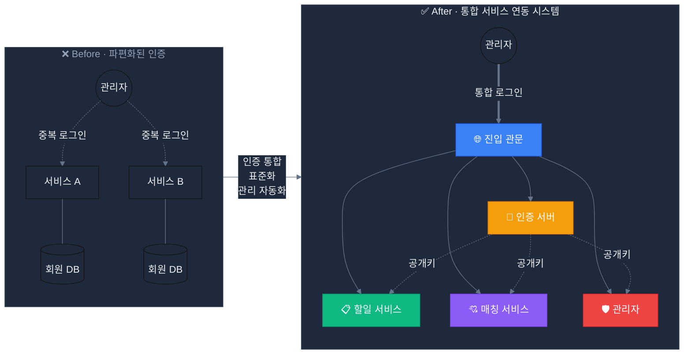
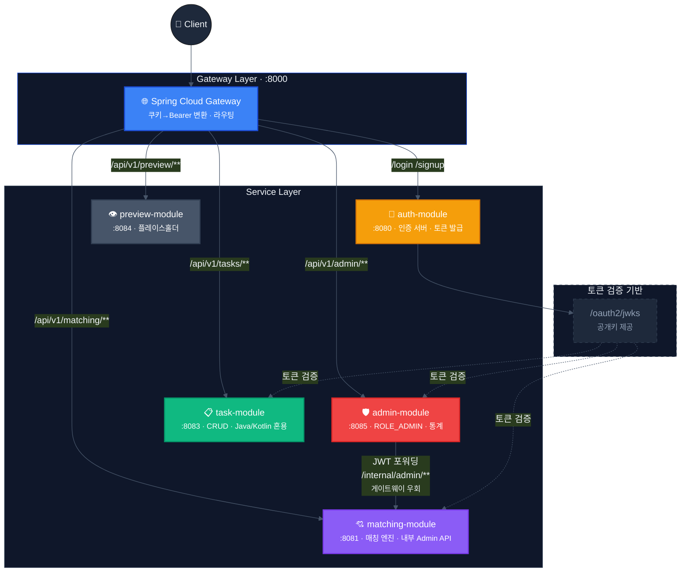

# Auth Gateway Platform

Spring Authorization Server와 Spring Cloud Gateway를 활용한 중앙 인증 및 멀티서비스 접근 제어 시스템

---

## 🎯 프로젝트 목표

서비스마다 따로 구현된 로그인 체계를 **하나의 인증 서버**로 통합하고 검증하는 서비스

---

## 🔨 하네스 엔지니어링 여정

> 기능을 하나씩 추가하며 전체 시스템을 점진적으로 완성한 실제 개발 흐름.

```mermaid
%%{init: {'theme': 'base', 'themeVariables': {'primaryColor': '#1e293b', 'primaryTextColor': '#f1f5f9', 'lineColor': '#475569', 'secondaryColor': '#0f172a', 'tertiaryColor': '#1e293b', 'clusterBkg': '#0f172a', 'clusterBorder': '#1e293b', 'titleColor': '#f1f5f9', 'nodeBorder': '#334155', 'mainBkg': '#1e293b'}}}%%
flowchart LR
    subgraph L1["① 인증 기반"]
        A1["🔐 OAuth2 AS\nJWT 발급·RTR"]
        A2["👤 사용자 도메인\n회원가입·로그인\n비밀번호 변경"]
    end

    subgraph L2["② 인프라"]
        B1["🌐 Gateway\n쿠키→Bearer 변환\n서비스 라우팅"]
        B2["🚦 트래픽 제어\nRate Limit\n대기열(Waiting Room)"]
    end

    subgraph L3["③ 서비스 확장"]
        C1["📊 서비스 운영 현황판\n보안 업그레이드\n상태 점검"]
        C2["📋 Task Service\n👁 Preview Service"]
    end

    subgraph L4["④ 도메인 & 관리"]
        D1["💘 매칭 엔진\n노출·순위·상호매칭\n인메모리 ConcurrentHashMap"]
        D2["🛡️ 관리자 시스템\nROLE_ADMIN JWT\n차단·통계·RestClient"]
    end

    L1 -->|"JWKS 제공\nJWT 검증 기반 확보"| L2
    L2 -->|"라우팅 규칙\n쿠키 필터 적용"| L3
    L3 -->|"서비스 구조 안정화"| L4

    style L1 fill:#0f172a,color:#f1f5f9,stroke:#f59e0b,stroke-width:2px
    style L2 fill:#0f172a,color:#f1f5f9,stroke:#3b82f6,stroke-width:2px
    style L3 fill:#0f172a,color:#f1f5f9,stroke:#10b981,stroke-width:2px
    style L4 fill:#0f172a,color:#f1f5f9,stroke:#ef4444,stroke-width:2px
    style A1 fill:#1e293b,color:#fcd34d,stroke:#f59e0b
    style A2 fill:#1e293b,color:#fcd34d,stroke:#f59e0b
    style B1 fill:#1e293b,color:#93c5fd,stroke:#3b82f6
    style B2 fill:#1e293b,color:#93c5fd,stroke:#3b82f6
    style C1 fill:#1e293b,color:#6ee7b7,stroke:#10b981
    style C2 fill:#1e293b,color:#6ee7b7,stroke:#10b981
    style D1 fill:#1e293b,color:#c4b5fd,stroke:#8b5cf6
    style D2 fill:#1e293b,color:#fca5a5,stroke:#ef4444
```

---

## 🚀 개발 로드맵

```mermaid
%%{init: {'theme': 'base', 'themeVariables': {'primaryColor': '#1e293b', 'primaryTextColor': '#f1f5f9', 'lineColor': '#475569', 'edgeLabelBackground': '#0f172a'}}}%%
graph LR
    P1("<b>Phase 1</b><br/>문제 정의<br/>아키텍처 설계")
    P2("<b>Phase 2</b><br/>Auth Server 구현<br/>보안 프로토콜 적용")
    P3("<b>Phase 3</b><br/>SSO 통합<br/>반복 로그인 제거")
    P35("<b>Phase 3.5</b><br/>트래픽 제어<br/>인증 안정성 확보")
    P4("<b>Phase 4</b><br/>서비스 운영 현황판<br/>보안 업그레이드")
    P5("<b>Phase 5</b><br/>Render 클라우드<br/>배포 환경 구성")
    P6("<b>Phase 6 ★</b><br/>매칭 엔진<br/>관리자 시스템")

    P1 --> P2 --> P3 --> P35 --> P4 --> P5 --> P6

    style P1  fill:#1e293b,color:#94a3b8,stroke:#334155,stroke-width:2px
    style P2  fill:#1e293b,color:#94a3b8,stroke:#334155,stroke-width:2px
    style P3  fill:#1e293b,color:#94a3b8,stroke:#334155,stroke-width:2px
    style P35 fill:#1e293b,color:#94a3b8,stroke:#334155,stroke-width:2px
    style P4  fill:#1e293b,color:#94a3b8,stroke:#334155,stroke-width:2px
    style P5  fill:#1e293b,color:#94a3b8,stroke:#334155,stroke-width:2px
    style P6  fill:#ef4444,color:#ffffff,stroke:#dc2626,stroke-width:3px

    click P1 "./docs/phase/phase1.md"
    click P2 "./docs/phase/phase2.md"
    click P3 "./docs/phase/phase3.md"
    click P35 "./docs/phase/phase3_5.md"
    click P4 "./docs/phase/phase4.md"
```

---

## 🌐 시스템 아키텍처

### 요청 흐름 요약

| 경로 | 대상 모듈 | 인증 |
|:---|:---|:---:|
| `/login`, `/signup`, `/api/v1/users/**` | auth-module :8080 | Public |
| `/api/v1/matching/**` | matching-module :8081 | JWT (모든 사용자) |
| `/api/v1/tasks/**` | task-module :8083 | JWT (모든 사용자) |
| `/api/v1/admin/**` | admin-module :8085 | JWT `ROLE_ADMIN` |
| `/internal/admin/**` | matching-module (직접) | JWT `ROLE_ADMIN` · Gateway 비노출 |

> Gateway는 라우팅과 쿠키→Bearer 변환만 담당하며 JWT를 검증하지 않습니다. JWT 검증과 인가는 각 리소스 서버가 Auth의 JWKS를 이용해 독립적으로 수행합니다.

---

## 📈 개발 현황

### Phase 6 · 매칭 & 관리자 시스템 (현재 마일스톤)

| 분류 | 항목 | 상태 |
|:---|:---|:---:|
| **매칭 엔진** | `ConcurrentHashMap` 기반 인메모리 매칭 저장소 | ✅ |
| **매칭 엔진** | 노출·순위(1~3위)·상호 매칭 플로우 | ✅ |
| **매칭 엔진** | 차단 사용자 추천 제외 및 순위 부여 차단 | ✅ |
| **관리자** | admin-module 신규 구성 (포트 8085, ROLE_ADMIN JWT) | ✅ |
| **관리자** | 사용자 조회·노출·차단 관리 API | ✅ |
| **관리자** | 매칭 조회·강제 삭제 API | ✅ |
| **관리자** | 통계 API (요약·성사율·인기 사용자) | ✅ |
| **관리자** | 서비스 간 직접 통신 (인증 정보 전달) | ✅ |
| **테스트** | 관리자 5개 · 매칭 서비스 6개 단위 테스트 | ✅ |
| **버그 수정** | `updateExposure` isBlocked 상태 손실 (BUG-001) | ✅ |

### Phase 1~5 · 기반 구축

| 분류 | 항목 | 상태 |
|:---|:---|:---:|
| **인증** | 중앙 인증 서버 · 공개키 배포 엔드포인트 | ✅ |
| **인증** | 로그인 토큰(15분) · 갱신 토큰(7일) · 자동 갱신 전략 | ✅ |
| **인증** | 구글 소셜 로그인 · 폼 로그인 · 회원가입 | ✅ |
| **인증** | 비밀번호 변경 · 갱신 토큰 서버 저장소 | ✅ |
| **인증** | 커스텀 로그인 화면 (`login.html`, `signup.html`) | ✅ |
| **진입 관문** | 쿠키 → 인증 헤더 자동 변환 | ✅ |
| **진입 관문** | 서비스 운영 현황판 · 상태 점검 | ✅ |
| **진입 관문** | 보안 설정 업그레이드 | ✅ |
| **트래픽** | 대기열 접근 상태 인터페이스 (현재 인메모리·즉시 허용) | ✅ |
| **트래픽** | IP Rate Limit | 📅 |
| **배포** | 클라우드 배포 (진입 관문 · 인증 · 할일 · 미리보기 서비스) | ✅ |

> ✅ 완료 &nbsp;&nbsp; 🔄 진행 중 &nbsp;&nbsp; 📅 예정

---

## 🛠 Tech Stack

| 분류 | 기술 |
|:---|:---|
| **Language** | Kotlin 2.2.0 · Java 21 |
| **Framework** | Spring Boot 3.5.3 · Spring Cloud Gateway |
| **Security** | Spring Security · Spring Authorization Server |
| **Persistence** | Auth: PostgreSQL(prod)·H2(dev) · Task: H2 · Matching/Refresh Token/대기열: In-memory |
| **Testing** | JUnit 5 · Mockito-Kotlin 5.4.0 |
| **Build** | Gradle 9.2.1 (Kotlin DSL) · Multi-module |
| **Deploy** | Render · Docker |

---

## 📑 핵심 문서

### 인증 & 보안

- **[token_strategy_guide.md](./docs/auth/token_strategy_guide.md)** — 토큰 발급·갱신 전략 상세 설계
- **[SECURITY_UPGRADE_REPORT.md](./docs/auth/SECURITY_UPGRADE_REPORT.md)** — 보안 설정 업그레이드 리포트
- **[PROJECT_MANIFESTO.md](./docs/PROJECT_MANIFESTO.md)** — 프로젝트 존재 이유 및 검증 시나리오
- **[DECISION_LOG_WHY.md](./docs/DECISION_LOG_WHY.md)** — 기술 선택 트레이드오프 기록

### 진입 관문 & 인프라

- **[gateway-ha-strategy.md](./docs/gateway/gateway-ha-strategy.md)** — 고가용성 전략
- **[health-check-implementation.md](./docs/gateway/health-check-implementation.md)** — 서비스 상태 점검 구현
- **[TRAFFIC_CONTROL_STRATEGY.md](./docs/TRAFFIC_CONTROL_STRATEGY.md)** — 대기열 기반 트래픽 제어 전략

### 매칭 & 관리자

- **[matching_plan.md](./docs/matching/matching_plan.md)** — 매칭 엔진 설계
- **[admin-management-design.md](./docs/superpowers/specs/2026-05-10-admin-management-design.md)** — 관리자 시스템 설계 명세
- **[BUG-001](./docs/engineering/bug-reports/BUG-001-updateExposure-resets-isBlocked.md)** — isBlocked 상태 손실 버그 리포트

### 엔지니어링

- **[harness-engineering.md](./docs/engineering/2026-05-10-harness-engineering.md)** — 전체 시스템 엔지니어링 정리

---

## 🌍 라이브 데모

| 서비스 | URL |
|:---|:---|
| Gateway Portal | [api-gateway-m46j.onrender.com](https://api-gateway-m46j.onrender.com) |
| Preview Portal | [preview-l7aj.onrender.com](https://preview-l7aj.onrender.com) |
| Task Portal | [task-1px8.onrender.com](https://task-1px8.onrender.com) |
