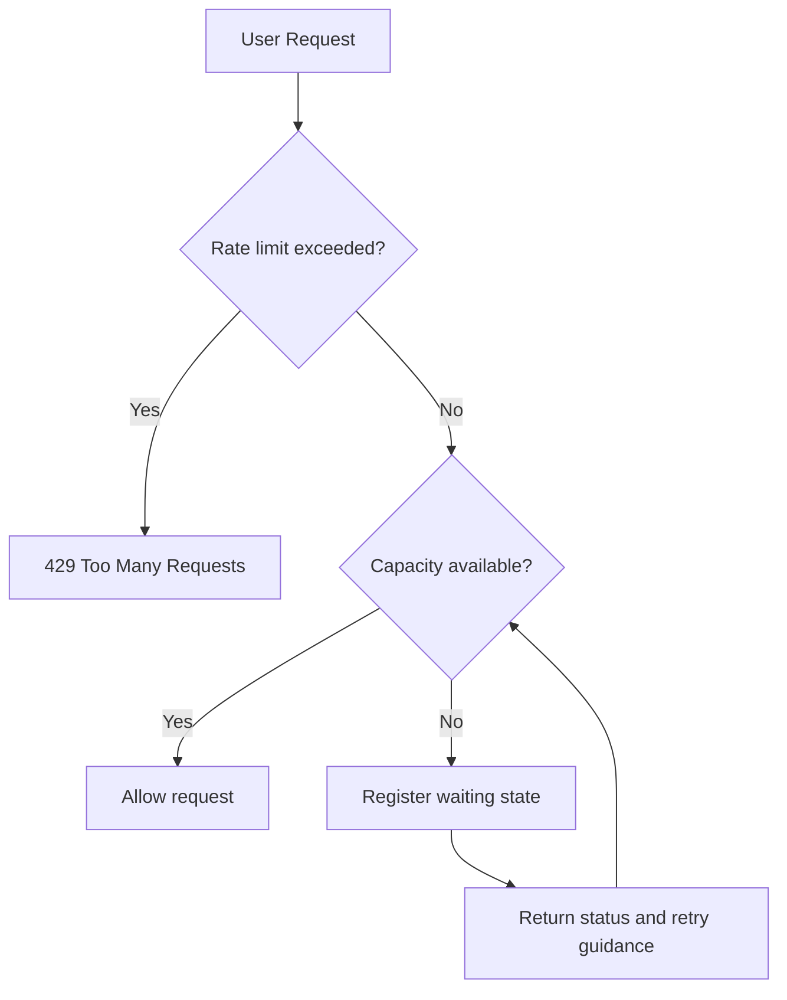

# Traffic Control Strategy

## 1. 문서 상태

이 문서는 트래픽 제어의 현재 구현과 향후 설계를 구분해 기록합니다. 저장소에는 대규모 부하 테스트 결과가 없으며, 처리량이나 동시 접속 규모를 보장하지 않습니다.

## 2. 현재 구현

현재 `WaitingRoomService`는 `ConcurrentHashMap`에 사용자별 서비스 접근 허용 상태를 저장합니다.

- 등록 요청은 즉시 `ALLOWED`를 반환합니다.
- 대기 순번 계산, 배치 진입, Rate Limit은 아직 구현하지 않았습니다.
- 상태는 프로세스 재시작 시 사라지며 여러 인스턴스 간 공유되지 않습니다.

따라서 현재 구현은 가상 대기열 완성본이 아니라 API 흐름과 접근 상태 모델을 확인하기 위한 기반입니다.

## 3. 목표 흐름

## 4. 단계별 구현 전략

### Rate Limit

- IP, 사용자 또는 클라이언트 기준을 명확히 정합니다.
- 제한값은 코드가 아닌 설정으로 관리합니다.
- 제한 초과 시 `Retry-After`와 일관된 오류 형식을 반환합니다.

### Waiting Room

- 대기 순서와 중복 등록 규칙을 정의합니다.
- 이탈 사용자와 만료된 대기 상태의 정리 정책을 둡니다.
- 서버가 허용 가능한 양만큼만 진입시키되, 허용량은 부하 테스트로 결정합니다.

### 외부 상태 저장소

다중 인스턴스가 필요해질 때 인메모리 저장소를 순서와 만료를 지원하는 외부 공유 저장소로 교체합니다. 구체적인 제품은 운영 복잡도와 장애 시 동작을 검토한 뒤 선택합니다.

## 5. 검증 항목

- 제한 이하 요청의 정상 처리
- 제한 초과 요청의 429 응답
- 동일 사용자의 중복 등록 방지
- 대기 상태 만료와 정리
- 여러 인스턴스에서 대기 순서 일관성
- 상태 저장소 지연·장애 시 실패 방식
